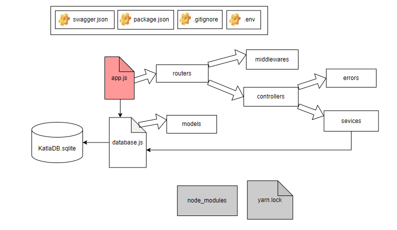

- [Description](#description)
- [Requirements](#requirements)
- [Front-end](#client)
- [Back-end](#server)
- [First start](#start)

## <a id="description">Description</a>

Project from <https://github.com/belpyro/artlogic-katla> with another stack. 

Front-end use NodeJS + React.

Back-end use NodeJS + express. SQLite is used as a database and provided with [Sequelize](https://sequelize.org/docs/v6/) (ORM tool). For API documentation used Swagger 2.0


## <a id="requirements">Requirements</a>

Required installation: 
-	[NodeJS](https://nodejs.org/en/download/current)
-	[VisualStudio Code](https://code.visualstudio.com/)

After installing NodeJS, install package “yarn" globally:

`npm install -g yarn`

(optional) After installing VisualStudio Code, install extension “[SQLite3 editor](https://marketplace.visualstudio.com/items?itemName=yy0931.vscode-sqlite3-editor)" for VisualStudio Code. This extension provides SQLite database management in VisualStudio Code.


## <a id="client">Front-end</a>

Project located in “artlogic-katla-client" and created with *yarn create react-app*. 

Installed additional packages: axios, dotenv, formik, react-router-dom, yup


## <a id="server">Back-end</a>

Project located in “artlogic-katla-server" and created with *yarn init*. 

Swagger UI route is “/api-docs". For example, if you started project on localhost with port 3001, you could follow the link <http://localhost:3001/api-docs> for Swagger UI documentation. Swagger configuration in the file “swagger.json".

Installed packages: cors, dotenv, express, express-validator, nodemon, sequelize, sqlite, sqlite3, swagger-ui-express

Project structure:

:
 

## <a id="start">First start</a>

After fulfilling of the [requirements](#requirements), create and configure “.env" files on client and server sides. Create .env files on main folders. 

On client side .env file must be with parameter *REACT_APP_SERVER_URL* (url of back-end server). Example of content:
```
REACT_APP_SERVER_URL=http://localhost:3001
```

On back-end server side .env file must be with parameters:  
*PORT* (port of the server)  
*NODE_ENV* (development/production/test).  
In development mode, the database cleans up every time it runs, recreates tables, and adds records for testing. Example of content (default values):
```
PORT=3001
NODE_ENV=development
```

After this, install all dependencies. Front-end and back-end parts use *yarn package* and have same procedure to install. You must open console (in Visual Studio Code, for example), go to the front-end/back-end folder and install all dependencies using the command:

`yarn install`

Configuring .env files and installing dependencies is done only once. In the future, the front-end/back-end parts are started using the command:

`yarn run start`

